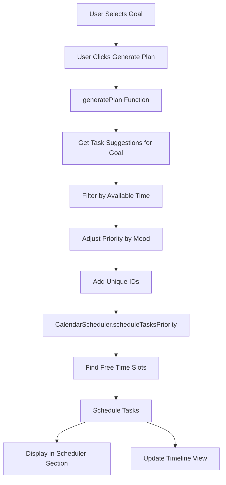

# LifePilot Enhancement Implementation Plan

## Overview
This plan outlines the changes needed to enhance the LifePilot application by:
1. Simplifying the UI by removing Work/Finance goals and Budget section
2. Adding intelligent task suggestions based on selected goals
3. Integrating automatic scheduling using the CalendarScheduler

---

## 1. UI Modifications

### 1.1 Remove Work and Finance from Goal Dropdown
**Location:** [`lifepilot.html`](lifepilot.html:852-858)

**Current Code:**
```html
<select id="goal" onchange="updateSelections()">
  <option value="Work" selected>Work</option>
  <option value="Study">Study</option>
  <option value="Health">Health</option>
  <option value="Social">Social</option>
  <option value="Finance">Finance</option>
</select>
```

**New Code:**
```html
<select id="goal" onchange="updateSelections()">
  <option value="Study" selected>Study</option>
  <option value="Health">Health</option>
  <option value="Social">Social</option>
</select>
```

### 1.2 Remove Budget Question Card
**Location:** [`lifepilot.html`](lifepilot.html:872-880)

**Action:** Delete the entire budget question card div

### 1.3 Remove Budget Metrics Card
**Location:** [`lifepilot.html`](lifepilot.html:905-912)

**Action:** Delete the entire budget metrics card div

### 1.4 Update Subtitle Text
**Location:** [`lifepilot.html`](lifepilot.html:833)

**Current:** "Choose your mood, goal, available time and budget."
**New:** "Choose your mood, goal, and available time."

**Location:** [`lifepilot.html`](lifepilot.html:793)

**Current:** "...based on your mood, time, goals and budget."
**New:** "...based on your mood, time, and goals."

---

## 2. Task Suggestions Design

### 2.1 Social Goal Suggestions
```javascript
Social: [
  {
    name: "Visit Local Coffeeshop",
    description: "Enjoy a coffee and people-watch at a cozy local spot",
    time: 60,
    emoji: "☕",
    priority: 5
  },
  {
    name: "Evening Bar Meetup",
    description: "Casual drinks with friends at a neighborhood bar",
    time: 120,
    emoji: "🍺",
    priority: 4
  },
  {
    name: "Park Walk with Friend",
    description: "Take a relaxing walk and catch up with someone",
    time: 45,
    emoji: "🌳",
    priority: 6
  },
  {
    name: "Join Community Event",
    description: "Attend a local meetup or community gathering",
    time: 90,
    emoji: "🎉",
    priority: 5
  },
  {
    name: "Game Night",
    description: "Host or join a casual board game session",
    time: 150,
    emoji: "🎲",
    priority: 4
  }
]
```

### 2.2 Study Goal Suggestions
```javascript
Study: [
  {
    name: "Library Study Session",
    description: "Deep focus work at the library",
    time: 120,
    emoji: "📚",
    priority: 8
  },
  {
    name: "Online Course Module",
    description: "Complete one module of your online course",
    time: 60,
    emoji: "💻",
    priority: 7
  },
  {
    name: "Study Group Meeting",
    description: "Collaborate with peers on challenging topics",
    time: 90,
    emoji: "👥",
    priority: 6
  },
  {
    name: "Practice Problems",
    description: "Work through practice exercises and problems",
    time: 45,
    emoji: "✍️",
    priority: 7
  },
  {
    name: "Review and Summarize",
    description: "Review notes and create summary sheets",
    time: 30,
    emoji: "📝",
    priority: 5
  }
]
```

### 2.3 Health Goal Suggestions
```javascript
Health: [
  {
    name: "Gym Workout",
    description: "Full body workout at the gym",
    time: 60,
    emoji: "💪",
    priority: 7
  },
  {
    name: "Yoga Class",
    description: "Attend a yoga or stretching class",
    time: 75,
    emoji: "🧘",
    priority: 6
  },
  {
    name: "Outdoor Run",
    description: "Go for a refreshing run in nature",
    time: 30,
    emoji: "🏃",
    priority: 6
  },
  {
    name: "Meal Prep Session",
    description: "Prepare healthy meals for the week",
    time: 90,
    emoji: "🥗",
    priority: 5
  },
  {
    name: "Meditation Practice",
    description: "Guided meditation for mental wellness",
    time: 20,
    emoji: "🧠",
    priority: 7
  },
  {
    name: "Swimming",
    description: "Low-impact cardio at the pool",
    time: 45,
    emoji: "🏊",
    priority: 6
  }
]
```

---

## 3. CalendarScheduler Integration

### 3.1 Add Script Reference
**Location:** After the closing `</style>` tag in [`lifepilot.html`](lifepilot.html)

```html
<script src="calendar-scheduler.js"></script>
```

### 3.2 Initialize Scheduler
**Location:** In the JavaScript section, after DOMContentLoaded

```javascript
// Initialize CalendarScheduler
const scheduler = new CalendarScheduler();
scheduler.setWorkingHours(8, 22); // 8 AM to 10 PM for more flexibility
```

---

## 4. Generate Plan Function Enhancement

### 4.1 New Task Suggestions Object
**Location:** Replace the existing `plans` object in [`lifepilot.html`](lifepilot.html:1105-1138)

```javascript
const taskSuggestions = {
  Study: [
    { name: "Library Study Session", description: "Deep focus work at the library", time: 120, emoji: "📚", priority: 8 },
    { name: "Online Course Module", description: "Complete one module of your online course", time: 60, emoji: "💻", priority: 7 },
    { name: "Study Group Meeting", description: "Collaborate with peers on challenging topics", time: 90, emoji: "👥", priority: 6 },
    { name: "Practice Problems", description: "Work through practice exercises and problems", time: 45, emoji: "✍️", priority: 7 },
    { name: "Review and Summarize", description: "Review notes and create summary sheets", time: 30, emoji: "📝", priority: 5 }
  ],
  Health: [
    { name: "Gym Workout", description: "Full body workout at the gym", time: 60, emoji: "💪", priority: 7 },
    { name: "Yoga Class", description: "Attend a yoga or stretching class", time: 75, emoji: "🧘", priority: 6 },
    { name: "Outdoor Run", description: "Go for a refreshing run in nature", time: 30, emoji: "🏃", priority: 6 },
    { name: "Meal Prep Session", description: "Prepare healthy meals for the week", time: 90, emoji: "🥗", priority: 5 },
    { name: "Meditation Practice", description: "Guided meditation for mental wellness", time: 20, emoji: "🧠", priority: 7 },
    { name: "Swimming", description: "Low-impact cardio at the pool", time: 45, emoji: "🏊", priority: 6 }
  ],
  Social: [
    { name: "Visit Local Coffeeshop", description: "Enjoy a coffee and people-watch at a cozy local spot", time: 60, emoji: "☕", priority: 5 },
    { name: "Evening Bar Meetup", description: "Casual drinks with friends at a neighborhood bar", time: 120, emoji: "🍺", priority: 4 },
    { name: "Park Walk with Friend", description: "Take a relaxing walk and catch up with someone", time: 45, emoji: "🌳", priority: 6 },
    { name: "Join Community Event", description: "Attend a local meetup or community gathering", time: 90, emoji: "🎉", priority: 5 },
    { name: "Game Night", description: "Host or join a casual board game session", time: 150, emoji: "🎲", priority: 4 }
  ]
};
```

### 4.2 Modified generatePlan() Function
**Location:** Replace existing [`generatePlan()`](lifepilot.html:1215-1251) function

```javascript
function generatePlan() {
  const goal = document.getElementById("goal").value;
  const mood = document.getElementById("mood").value;
  const time = document.getElementById("time").value;

  // Get task suggestions for the selected goal
  const tasks = taskSuggestions[goal] || [];
  
  // Filter tasks based on available time
  let filteredTasks = [...tasks];
  const timeInMinutes = parseTimeToMinutes(time);
  
  // Adjust task selection based on available time
  if (timeInMinutes <= 30) {
    filteredTasks = tasks.filter(t => t.time <= 30);
  } else if (timeInMinutes <= 60) {
    filteredTasks = tasks.filter(t => t.time <= 60);
  } else if (timeInMinutes <= 240) { // Half day
    filteredTasks = tasks.filter(t => t.time <= 120);
  }
  
  // Adjust priority based on mood
  filteredTasks = filteredTasks.map(task => {
    let adjustedPriority = task.priority;
    if (mood === "Tired" || mood === "Unmotivated") {
      // Prefer shorter, easier tasks
      if (task.time <= 30) adjustedPriority += 2;
    } else if (mood === "Energetic") {
      // Prefer longer, more intensive tasks
      if (task.time >= 60) adjustedPriority += 2;
    }
    return { ...task, priority: adjustedPriority };
  });

  // Add unique IDs to tasks
  const tasksWithIds = filteredTasks.map((task, index) => ({
    ...task,
    id: `${goal.toLowerCase()}-${index}-${Date.now()}`
  }));

  // Schedule tasks using CalendarScheduler
  scheduleTasksToCalendar(tasksWithIds);
  
  // Update the timeline view with scheduled tasks
  updateTimelineView(tasksWithIds);
  
  // Update selections
  updateSelections();
}

function parseTimeToMinutes(timeStr) {
  if (timeStr === "15 min") return 15;
  if (timeStr === "1 hour") return 60;
  if (timeStr === "Half day") return 240;
  if (timeStr === "Full day") return 480;
  return 60;
}
```

---

## 5. Scheduler Integration Functions

### 5.1 Schedule Tasks to Calendar
```javascript
function scheduleTasksToCalendar(tasks) {
  // Get existing events (if any)
  const existingEvents = []; // Could be loaded from ICS file or localStorage
  
  // Use priority-based scheduling
  const result = scheduler.scheduleTasksPriority(tasks, existingEvents, new Date(), 7);
  
  // Display scheduled tasks
  displayScheduledTasks(result.scheduled);
  
  // Show unscheduled tasks if any
  if (result.unscheduled.length > 0) {
    console.warn("Some tasks could not be scheduled:", result.unscheduled);
    showUnscheduledWarning(result.unscheduled);
  }
  
  // Store scheduled tasks
  window.scheduledTasks = result.scheduled;
}

function displayScheduledTasks(scheduledTasks) {
  const scheduleList = document.getElementById("scheduleList");
  
  // Clear existing schedule (except drop zone)
  const dropZone = scheduleList.querySelector(".drop-zone");
  scheduleList.innerHTML = "";
  
  // Add scheduled tasks
  scheduledTasks.forEach(task => {
    const block = document.createElement("div");
    block.className = "schedule-block block-blue";
    
    const startTime = task.scheduledStart.toLocaleTimeString('en-US', { 
      hour: '2-digit', 
      minute: '2-digit' 
    });
    
    block.innerHTML = `${task.emoji} ${task.name} <span>${startTime}</span>`;
    scheduleList.appendChild(block);
  });
  
  // Re-add drop zone at the end
  if (dropZone) {
    scheduleList.appendChild(dropZone);
  }
}

function updateTimelineView(tasks) {
  const timelineList = document.getElementById("timelineList");
  
  timelineList.innerHTML = tasks.map(task => `
    <div class="timeline-item">
      <div class="timeline-time">Suggested</div>
      <div class="timeline-card">
        <div class="timeline-info">
          <div class="timeline-emoji">${task.emoji}</div>
          <div>
            <h4>${task.name}</h4>
            <p>${task.description}</p>
          </div>
        </div>
        <span class="duration">${task.time} min</span>
      </div>
    </div>
  `).join("");
}

function showUnscheduledWarning(unscheduledTasks) {
  // Optional: Show a notification to the user
  console.log("Could not schedule these tasks:", unscheduledTasks.map(t => t.name));
}
```

---

## 6. JavaScript Cleanup

### 6.1 Remove Budget References
**Locations to update:**
- [`updateSelections()`](lifepilot.html:1148-1163) - Remove budget parameter
- [`updateMetrics()`](lifepilot.html:1165-1213) - Remove budget logic
- Remove all budget-related variables and calculations

### 6.2 Update Goal Icons
**Location:** [`goalIcons`](lifepilot.html:1097-1103) object

```javascript
const goalIcons = {
  Study: "📚",
  Health: "❤️",
  Social: "👥"
};
```

### 6.3 Remove Old Plans Object
**Location:** Remove the old [`plans`](lifepilot.html:1105-1138) object entirely

---

## 7. Testing Checklist

- [ ] UI displays only Study, Health, and Social options
- [ ] Budget section is completely removed
- [ ] Subtitle text is updated correctly
- [ ] Selecting "Study" and clicking Generate Plan shows study-related tasks
- [ ] Selecting "Health" and clicking Generate Plan shows health-related tasks
- [ ] Selecting "Social" and clicking Generate Plan shows social-related tasks
- [ ] Tasks are automatically scheduled to the calendar section
- [ ] Scheduled tasks show appropriate times
- [ ] Mood affects task selection appropriately
- [ ] Time selection filters tasks correctly
- [ ] No console errors appear
- [ ] CalendarScheduler integration works smoothly

---

## 8. Architecture Diagram



---

## 9. Implementation Order

1. **Phase 1: UI Cleanup** (Simple, no dependencies)
   - Remove Work and Finance from dropdown
   - Remove Budget question card
   - Remove Budget metrics card
   - Update subtitle texts

2. **Phase 2: Task Suggestions** (Core functionality)
   - Create taskSuggestions object
   - Design comprehensive suggestions for each goal

3. **Phase 3: Scheduler Integration** (Complex, requires testing)
   - Add CalendarScheduler script reference
   - Initialize scheduler
   - Create helper functions

4. **Phase 4: Generate Plan Enhancement** (Ties everything together)
   - Modify generatePlan() function
   - Implement filtering and priority logic
   - Connect to scheduler

5. **Phase 5: Cleanup and Testing** (Final polish)
   - Remove old code
   - Update all references
   - Comprehensive testing

---

## Notes

- The CalendarScheduler uses a priority-based algorithm that considers task priority, deadline urgency, and optimal time of day
- Tasks are scheduled within working hours (8 AM - 10 PM by default)
- The system automatically finds free time slots and avoids conflicts
- Mood affects task priority: tired/unmotivated users get shorter tasks prioritized
- Time selection filters which tasks are suggested
- All scheduled tasks are stored in `window.scheduledTasks` for potential export to ICS format
